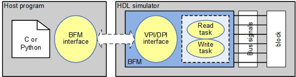

# HW-SW Co-Simulation Library for AMBA AXI BFM using DPI/VPI
*Cosim BFM library* is a package to provide HW-SW co-simulation
between the HDL (Hardware Description Language) simulator and the host program,
where BFM (Bus Functional Model
or Bus Functional Module) generates bus transaction by interacting
with the host program in C or Python.

||
|:---:|
| *Co-simulation using BFM* |

## Table of contents

<details><summary>Click to expand table of contents</summary>

1. [Getting started](#getting_started)<br>
   1.1 [Getting started using DPI](#getting_started_dpi)<br>
   1.2 [Getting started using VPI](#getting_started_vpi)
2. [Installation](#installation)<br>
   2.1 [DPI for Xilinx xsim](#installation_xsim)<br>
   2.2 [VPI for Icarus Verilog](#installation_iverilog)
3. [Software side](#sw_side)<br>
   3.1 [C API for software side](#c_api_sw)<br>
   3.2 [Python functions for software side](#python_api_sw)
4. [Hardware side](#hw_side)<br>
   4.1 [DPI functions for hardware side](#dpi_hw)<br>
   4.2 [VPI functions for hardware side](#vpi_hw)
7. [Troubleshooting](#troubleshooting)
8. [Where to get more information](#where_to_get)
9. [Other things](#other_things)

</details>

---

### License<a name="license"></a>
This is licensed with the 2-clause BSD license to make the program and library useful in open and closed source products independent of their licensing scheme.

### Prerequisites<a name="prerequisites"></a>
This program requires followings.
* Shell: Bash
* GNU GCC: C compiler
* HDL simulator: Xilinx Vivado simulator or icarus Verilog
* Python3 if Python interface is required

---

# 1. Getting started<a name="getting_started"></a>
Following picture shows a simple setup for testing memory through AMBA AXI bus,
where BFM generates write and read bus transactions under the control of
the C or Python program.

||
|:---:|
| *Co-simulation example* |

Make sure that following two environment variables should be defined properly.

 * **COSIM_HOME** environment variable is set to the directory
   where co-simulation library (libcosim_bfm.a or libcosim_bfm.so) is installed.
 * **PYTHONPATH** environment variable is set to the directory
   where co-simulation Python code (cosim_bfm.py) resides.

Add following code in the bash startup file, say *.bashrc* and run 'set_cosim' before you use this library,
where **COSIM_HOME** should be the directory path this library resides.

<details><summary>Click to expand example of .bashrc</summary>

```bash:
set_cosim() {
    export COSIM_HOME=/home/adki/work/cosim_library
    if [ -n "${PYTHONPATH}" ]; then
      export PYTHONPATH=$COSIM_HOME/include/python:$PYTHONPATH
    else
      export PYTHONPATH=$COSIM_HOME/include/python
    fi
}
```
</details>

### 1.1 Getting started using DPI<a name="getting_started_dpi"></a>
Xilinx Vivado simulator should be installed and available.

<details><summary>Click to expand</summary>

#### 1.1.1 preparing library

   1) go to 'lib_bfm' directory\
      *$ cd lib_bfm*
   2) compile and install\
      *$ make -f Makefile.xsim cleanup*\
      *$ make -f Makefile.xsim*\
      *$ make -f Makefile.xsim install*\
      . It should generate 'include' and 'lib/xsim' directories.

#### 1.1.2 running co-simulation

   3) go to example directory\
      *$ cd verification/test_axi_dpi_vpi*
   4) prepare two command windows and do as follows
      | HW-side          | SW-side       |
      | :---             | :---          |
      | $ cd hw/sim/xsim | $ cd sw       |
      | $ make           | $ make        |
      |                  | $ make run    |

   or
   4) simply run as follows\
      *$ make run_dpi*

#### 1.1.2 running co-simulation through Python

   3) go to example directory\
      *$ cd verification/test_axi_dpi_vpi*
   4) prepare two command windows and do as follows (use Python3)
      | HW-side          | Python-side   |
      | :---             | :---          |
      | $ cd hw/sim/xsim | $ cd python   |
      | $ make           | $ make run    |

   or
   4) simply run as follows\
      *$ make run_dpi*

   > Sometimes there may occur "ERROR: data buffer size mis-match" at the begining of co-simulation
   > due to un-expected messages. To deal with this, terminate all related program and re-invoke the program
</details>

### 1.2 Getting started using VPI<a name="getting_started_vpi"></a>
Icarus Verilog simulator should be installed and available.

<details><summary>Click to expand</summary>

#### 1.2.1 preparing library

   1) go to 'lib_bfm' directory\
      *$ cd lib_bfm*
   2) compile and install\
      *$ make -f Makefile.iverilog cleanup*\
      *$ make -f Makefile.iverilog*\
      *$ make -f Makefile.iverilog install*\
      . It should generate 'include' and 'lib/iverilog' directories.

#### 1.2.1 running co-simulation

   3) go to example directory\
      *$ cd verification/test_axi_dpi_vpi*
   4) prepare two command windows and do as follows
      | HW-side          | SW-side       |
      | :---             | :---          |
      | $ cd hw/sim/xsim | $ cd sw       |
      | $ make           | $ make        |
      |                  | $ make SIMULATOR=iverilog run |

   or
   4) simply run as follows\
      *$ make run_vpi*

#### 1.2.2 running co-simulation through Python

   3) go to example directory\
      *$ cd verification/test_axi_dpi_vpi*
   4) prepare two command windows and do as follows (use Python3)
      | HW-side          | Python-side   |
      | :---             | :---          |
      | $ cd hw/sim/xsim | $ cd python   |
      | $ make           | $ make SIMULATOR=iverilog run |

   or
   4) simply run as follows\
      *$ make run_vpi*

   > Sometimes there may occur "ERROR: data buffer size mis-match" at the begining of co-simulation
   > due to un-expected messages. To deal with this, terminate all related program and re-invoke the program
</details>

---
# 2. Installation<a name="installation"></a>
Installation prepares followings.

  * For host program
    - cosim_bfm_api.h
    - libcosim_bfm.a and libcosim_bfm.so
  * For HDL simulator of DPI
    - cosim_dpi_bfm.a and cosim_dpi_bfm.so
    - cosim_bfm_axi_dpi.sv
  * For HDL simulator of VPI
    - cosim_vpi_bfm.vpi
    - cosim_bfm_axi_vpi.v

### 2.1 DPI for Xilinx Xsim<a name="installation_xsim"></a>
Xilinx Vivado simulator should be installed and available.

   1) go to 'lib_bfm' directory\
      *$ cd lib_bfm*
   2) compile and install\
      *$ make -f Makefile.xsim cleanup*\
      *$ make -f Makefile.xsim*\
      *$ make -f Makefile.xsim install DIR_INSTALL=*path**\
      . It should generate 'include' and 'lib/xsim' directories specified by *DIR_INSTALL=*path**.\
      . If *DIR_INSTALL=*path** is not given, *..* by default.

### 2.2 VPI for Icarus Verilog<a name="installation_iverilog"></a>
Icarus Verilog simulator should be installed and available.

   1) go to 'lib_bfm' directory\
      *$ cd lib_bfm*
   2) compile and install\
      *$ make -f Makefile.iverilog cleanup*\
      *$ make -f Makefile.iverilog*\
      *$ make -f Makefile.iverilog install DIR_INSTALL=*path**\
      . It should generate 'include' and 'lib/iverilog' directories specified by *DIR_INSTALL=*path**.\
      . If *DIR_INSTALL=*path** is not given, *..* by default.

---
# 3. Software side<a name="sw_side"></a>
This host program sends/receives pre-defined packet to/form the HDL simulator over IPC channel.

<details><summary>Click to see packet format</summary>

```C:
typedef struct {
  unsigned int cmd_type;   // RD-REQ(1), WR-REQ(2), RD-RSP(5), WR-RSP(6), TERM-REQ(8)
  unsigned int cmd_size;   // num of bytes in a beat
  unsigned int cmd_length; // num of beats, i.e., burst length
  unsigned int cmd_ack;    // ERR(0), OK(1)
  unsigned int attr;       // user-specified attribute
  uint32_t     trans_id;   // transaction identification (for multiple outstanding case)
  uint32_t     addr;
  uint8_t      data[COSIM_DATA_BNUM]; // byte-stream up to 4*256 bytes
} bfm_packet_t;
```
</details>

### 3.1 C API for software side<a name="c_api_sw"></a>
Following shows a minimum code to deal with co-simulation and
there should be a corresponding hardware simulator.

```C:
#include "cosim_bfm_api.h"

int main(void) {
    int cid = 0;
    bfm_open   (cid);
    bfm_barrier(cid);
    ... your code using bfm_write() and bfm_read() ...
    bfm_close  (cid);
    return 0;
}
```

#### 3.1.1 Co-simulation handling routines for C/C++
* `bfm_open()` tries to create and open communication channel to the hardware simulator,
where `cid` specifies channel identification and 0 by default.
It returns 0 on success or negative number on failure.
```C:
int bfm_open(int cid);
```

* `bfm_close()` closes the communication channel with the channel `cid`.
It returns 0 on success or negative number on failure.
```C:
int bfm_close(int cid);
```

* `bfm_barrier()` waits for joining the hardware simulator.
It returns 0 on success or negative number on failure.
```C:
int bfm_barrier(int cid);
```

* `bfm_set_verbose()` sets verbosity level, where `level' is 0 by default to depress message.
It returns 0 on success or negative number on failure.
```C:
int bfm_set_verbose(int level);
```

* `bfm_get_verbose()` returns current verbosity level.
```C:
int bfm_get_verbose();
```

#### 3.1.2 Bus transaction routines for C/C++
* `bfm_write()` makes HW BFM generates a burst write transaction.
   * `addr` for the starting address that should be aligned with the `sz`.
   * `data` for the buffer containing byte-stream data to be written, where the size of `data` buffer should be `sz x length`.
   * `sz` for the number of bytes to be written at a each transaction and can be 1, 2, and 4.
   * returns 0 on success, otherwise negative number.
```C:
int bfm_write( uint32_t     addr
             , uint8_t     *data
             , unsigned int sz
             , unsigned int length);
```

* `bfm_read()` makes HW BFM generates a burst read transaction.
   * `addr` for the starting address that should be aligned with the `sz`.
   * `data` for the buffer to be contain byte-stream data after read, where the size of `data` buffer should be `sz x length`.
   * `sz` for the number of bytes to be written at a each transaction and can be 1, 2, and 4.
   * returns 0 on success, otherwise negative number.
```C:
int bfm_read ( uint32_t     addr
             , uint8_t     *data
             , unsigned int sz
             , unsigned int length);
```

### 3.2. Python functions for software side<a name="python_api_sw"></a>
> Python3 should be used.

Following shows a minimum code to deal with co-simulation and
there should be a corresponding hardware simulator.
Environment variable **PYTHONPATH** should contain the directory path
that *cosim_bfm.py* resides.

```Python:
#!/usr/bin/env python3

import cosim_bfm as cosim

simulator = xsim # can be "iverilog"
cid = 0

cosim.LoadCosimLib(simulator)
cosim.bfm_open(cid)
cosim.bfm_barrier(cid)

... your code using bfm_write() and bfm_read() ...

cosim.bfm_close(cid)
```

#### 3.2.1 Co-simulation handling routines for Python3
* `LoadCosimLib()` loads C shared library from **COSIM_HOME** environment variable,
where `simulator` specifies which HDL simulator and `xsim` or `iverilog` is supported
for this version.
```Python:
LoadCosimLib( simulator, rigor=False, verbose=False)
```

* `bfm_open()` tries to create and open communication channel to the hardware simulator,
where `cid` specifies channel identification and 0 by default.
It returns 0 on success or negative number on failure.
```Python:
bfm_open( cid=0, rigor=False, verbose=False )
```

* `bfm_close()` closes the communication channel with the channel `cid`.
It returns 0 on success or negative number on failure.
```Python:
bfm_close( cid=0, rigor=False, verbose=False )
```

* `bfm_barrier()` waits for joining the hardware simulator.
It returns 0 on success or negative number on failure.
```Python:
bfm_barrier( cid=0, rigor=False, verbose=False )
```

* `bfm_set_verbose()` sets verbosity level, where `level' is 0 by default to depress message.
It returns 0 on success or negative number on failure.
```Python:
bfm_set_verbose( level=0, rigor=False, verbose=False )
```

* `bfm_get_verbose()` returns current verbosity level.
```Python:
bfm_get_verbose( rigor=False, verbose=False )
```

#### 3.2.2 Bus transaction routines for Python3
* `bfm_write()` makes HW BFM generates a burst write transaction.
  * `addr` for the starting address that should be aligned with the `sz`.
  * `data` for the buffer containing byte-stream data to be written, where the size of `data` buffer should be `sz x length`.
  * `sz` for the number of bytes to be written at a each transaction and can be 1, 2, and 4.
  * returns 0 on success, otherwise negative number.
```Python:
bfm_write( addr, data, sz=4, length=1, rigor=False, verbose=False )
```

* `bfm_read()` makes HW BFM generates a burst read transaction.
  * `addr` for the starting address that should be aligned with the `sz`.
  * `data` for the buffer to be contain byte-stream data after read, where the size of `data` buffer should be `sz x length`.
  * `sz` for the number of bytes to be written at a each transaction and can be 1, 2, and 4.
  * returns 0 on success, otherwise negative number.
```Pyton:
bfm_read( addr, data, sz=4, length=1, rigor=False, verbose=False )
```

---
# 4. Hardware side<a name="hw_side"></a>
> AMBA AXI BFM is prepare, but other BFM can be easily prepared.

> Xilinx Vivado Simulator and Icarus Verilog are used to test this package,
> but other HDL simulator supporting DPI or VPI can be used without
> much difficulty.

BFM sends/receives pre-defined packet to/form the host program over IPC channel
and following picture shows an example of AMBA AXI BFM, where *IRQ* is for interrupt,
*GPIN[31:0]/GPOUT[31:0]* is for general purpose ports.

||
|:---:|
| *AMBA AXI BFM for Co-simulation* |

### 4.1 DPI functions for hardware side<a name="dpi_hw"></a>
More details can be found from the Verilog code *cosim_bfm_dpi.c* and *cosim_bfm_axi_core.v* in this package.
Following DPI functions correspond to the that of C API.

* `cosim_ipc_open()` creates and opens IPC channel.
```SystemVerilog:
import "DPI-C" cosim_ipc_open   =function int cosim_ipc_open   (input int cid);
```

* `cosim_ipc_close()` closes IPC channel.
```SystemVerilog:
import "DPI-C" cosim_ipc_close  =function int cosim_ipc_close  (input int cid);
```

* `cosim_ipc_barrier()` waits for joining the software program.
```SystemVerilog:
import "DPI-C" cosim_ipc_barrier=function int cosim_ipc_barrier(input int cid);
```

* `cosim_ipc_get()` receives a packet through IPC channel and carries out
operation specified by `pkt_cmd`, which includes read and write transaction.
```SystemVerilog:
import "DPI-C" cosim_ipc_get    =function int cosim_ipc_get(
                   input  int       cid  // IPC channel identification
                 , output int       pkt_cmd  // see cosim_bfm_defines.vh
                 , output int       pkt_size  // 1, 2, 4
                 , output int       pkt_length  // burst length
                 , output int       pkt_ack 
                 , output int       pkt_attr
                 , output int       pkt_trans_id
                 , output int       pkt_addr 
                 , output bit [7:0] pkt_data[]  // open-array
                 );
```

* `cosim_ipc_put()` sends a packet through IPC channel and it is usually called after `cosim_ipc_get()`
```SystemVerilog:
import "DPI-C" cosim_ipc_put  =function int cosim_ipc_put(
                   input  int       cid
                 , input  int       pkt_cmd
                 , input  int       pkt_size // 1, 2, 4
                 , input  int       pkt_length // burst length
                 , input  int       pkt_ack
                 , input  int       pkt_attr
                 , input  int       pkt_trans_id
                 , input  int       pkt_addr
                 , input  bit [7:0] pkt_data[] // open-array
                );
```

### 4.2 VPI functions for hardware side<a name="vpi_hw"></a>
More details can be found from the Verilog code *cosim_bfm_axi_vpi* and *cosim_bfm_axi_core.v* in this package.
Following VPI functions correspond to the that of C API.

* `$cosim_ipc_open()` creates and opens IPC channel.
```Verilog:
$cosim_ipc_open(cid);
```

* `cosim_ipc_close()` closes IPC channel.
```Verilog:
$cosim_ipc_close(cid);
```

* `cosim_ipc_barrier()` waits for joining the software program.
```Verilog:
$cosim_ipc_barrier(cid);
```

* `$cosim_ipc_get()` receives a packet through IPC channel and carries out
operation specified by `pkt_cmd`, which includes read and write transaction.
```Verilog:
$cosim_ipc_get( cid  // IPC channel identification
              , pkt_cmd  // see cosim_bfm_defines.vh
              , pkt_size  // 1, 2, 4
              , pkt_length  // burst length
              , pkt_ack 
              , pkt_attr
              , pkt_trans_id
              , pkt_addr 
              , pkt_data  // open-array
              );
```

* `$cosim_ipc_put()` sends a packet through IPC channel and it is usually called after `cosim_ipc_get()`
```Verilog:
$cosim_ipc_put( cid
              , pkt_cmd
              , pkt_size // 1, 2, 4
              , pkt_length // burst length
              , pkt_ack
              , pkt_attr
              , pkt_trans_id
              , pkt_addr
              , pkt_data[] // open-array
              );
```

---
# 7. Troubleshooting<a name="troubleshooting"></a>
*To be added.*

---
# 8. Where to get more information<a name="where_to_get"></a>
Source code is available from Ando's GitHub:
* https://github.com/adki/cosim_bfm_library

Lecture materials and codes of DPI are available from Ando's GitHub:
* Tutorial on DPI (Direct Programming Interface): https://github.com/adki/DPI_Tutorial

Lecture materials and codes on AMBA bus are available from Ando's GitHub:
* AMBA lecture materials at GitHub: https://github.com/adki/AMBA_AXI_AHB_APB

The author has been giving open lecture on AMBA bus at following two institutes:
* IDEC (IC Design Education Center) at KAIST: https://www.idec.or.kr
* SW-SoC Academy at ETRI: https://www.asic.net

---

# 9. Other things<a name="other_things"></a>

### Author(s)
* **Ando Ki** - *Initial work* - <a href="http://www.future-ds.com" target="_blank">Future Design Systems</a>

### Acknowledgments
Thanks to all who gave me valuable feedback.

### Revision history<a name="revision_history"></a>
* 2021.08.01: Started by Ando Ki (andoki(at)gmail.com).
---
